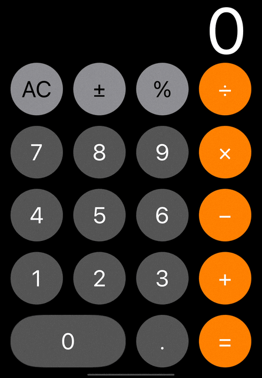

# Calculator

## Technical Stack
* iOS 11+
* Objective-c
* UIKit
* MVVM

## Overview

<table>
    <thead>
        <tr>
            <th>iPhone 14 Pro Max</th>
            <th>iPhone SE</th>
        </tr>
    </thead>
    <tbody>
        <tr>
            <td>
                 
            </td>
            <td>
                
            </td>
        </tr>
    </tbody>
</table>

<table>
<thead>
        <tr>
            <th>iPad</th>
        </tr>
    </thead>
    <tbody>
        <tr>
            <td>
                
            </td>
        </tr>
    </tbody>
</table>
